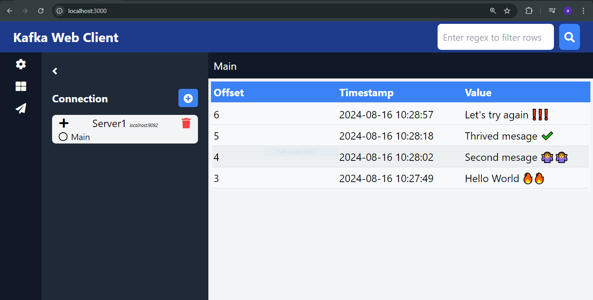

# Kafka Web Client




This project is a web-based client for interacting with Kafka clusters. It provides a user-friendly interface to connect to Kafka brokers, send messages, and listen to topics. The client is built with Express, Kafka-Node, Socket.io, and SQLite on the backend, and uses Tailwind CSS, jQuery, and FontAwesome on the frontend.

## Features

- **Connect to Kafka Brokers**: Manage connections to multiple Kafka brokers.
- **Send Messages**: Easily send messages to Kafka topics.
- **Listen to Topics**: Listen to Kafka topics and display real-time messages.
- **Topic Filtering**: Filter topics using regular expressions.
- **Responsive UI**: Built with Tailwind CSS for a responsive and clean interface.
- **Persistent Data**: Connections are stored in an SQLite database.

## Requirements

- Node.js
- npm (Node Package Manager)

## Installation

1. **Clone the repository:**

    ```bash
    git clone https://github.com/yourusername/kafka-web-client.git
    cd kafka-web-client
    ```

2. **Install dependencies:**

    ```bash
    npm install
    ```

3. **Start the server:**

    ```bash
    npm start
    ```

4. **Access the application:**

   Open your browser and navigate to `http://localhost:3000`.

## Project Structure

- **`server.js`**: The main server file that sets up the Express server and Kafka connections.
- **`public/`**: Contains static files like HTML, CSS, and client-side JavaScript.
  - **`index.html`**: The main HTML file for the UI.
  - **`script.js`**: Main JavaScript file handling the frontend logic.
- **`views/`**: Contains additional views or pages (if any).
- **`routes/`**: Contains route definitions for the Express server.
- **`models/`**: Contains data models (e.g., for SQLite).
- **`config/`**: Configuration files (e.g., for Kafka).

## How It Works

### Backend

- The backend is powered by Express and Kafka-Node.
- **Socket.io** is used for real-time communication between the client and server.
- **SQLite** is used for storing connection configurations.
- The server listens for incoming requests to interact with Kafka, such as sending messages or listening to topics.

### Frontend

- **Tailwind CSS** provides a responsive, modern UI.
- **jQuery** handles DOM manipulation and AJAX requests.
- **FontAwesome** is used for icons.
- **Toastr** is used for notifications.

### Key JavaScript Files

- **`script.js`**: Handles frontend logic, including form submissions, WebSocket events, and UI interactions.
- **`div-table.js`**: Custom implementation for rendering tables dynamically.
- **`server.js`**: Manages WebSocket connections and handles Kafka interactions on the backend.

## Usage

### Connecting to a Kafka Broker

1. Click on the settings (gear) icon in the sidebar.
2. Enter the Kafka broker's bootstrap server address (e.g., `localhost:9092`).
3. Optionally, provide a label for the connection.
4. Click "Save" to add the connection.

### Sending Messages

1. Click the "Send Message" icon (paper plane) in the sidebar.
2. Select a topic from the dropdown.
3. Enter the message to send.
4. Click "Send".

### Listening to Topics

1. Select a connection from the list.
2. Click on the desired topic to start listening.
3. Messages from the topic will be displayed in real-time.

### Filtering Messages

1. Enter a regular expression in the filter input.
2. Click the search icon to apply the filter.
3. Only messages matching the regex will be shown.

## Contributing

Contributions are welcome! Please fork this repository, create a new branch, and submit a pull request with your changes.

## License

This project is licensed under the MIT License.
